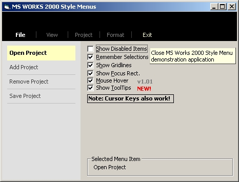



## MS Works 2000 style menus

### Description

Replicates MS Works 2000 horizontal and vertical menus. Displaying Disabled Items, Hover Items (Hot Tracking - v1.01), ToolTips (v1.02), Seperator Lines, etc all configurable. Demonstration application included to demonstrate all the features of the controls.
 
### More Info
 

             |
---                |---
**Submitted On**   |2001-06-09 21:45:04
**By**             |[Slider](https://github.com/Planet-Source-Code/PSCIndex/blob/master/ByAuthor/slider.md)
**Level**          |Intermediate
**User Rating**    |4.5 (67 globes from 15 users)
**Compatibility**  |VB 6\.0
**Category**       |[Custom Controls/ Forms/  Menus](https://github.com/Planet-Source-Code/PSCIndex/blob/master/ByCategory/custom-controls-forms-menus__1-4.md)
**World**          |[Visual Basic](https://github.com/Planet-Source-Code/PSCIndex/blob/master/ByWorld/visual-basic.md)
**Archive File**   |[MS Works 220860692001\.zip](https://github.com/Planet-Source-Code/slider-ms-works-2000-style-menus__1-23548/archive/master.zip)

